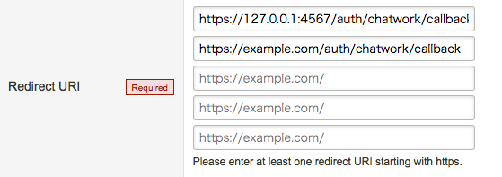

# OmniAuth::Chatwork

OmniAuth strategy for ChatWork

[](https://badge.fury.io/rb/omniauth-chatwork)
[](https://travis-ci.org/sue445/omniauth-chatwork)
[](https://codeclimate.com/github/sue445/omniauth-chatwork/maintainability)
[](https://coveralls.io/github/sue445/omniauth-chatwork)
[](https://gemnasium.com/github.com/sue445/omniauth-chatwork)

## Installation

Add this line to your application's Gemfile:

```ruby
gem 'omniauth-chatwork'
```

And then execute:

    $ bundle

Or install it yourself as:

    $ gem install omniauth-chatwork

## Usage
```ruby
use OmniAuth::Builder do
  provider :chatwork, ENV["CLIENT_ID"], ENV["CLIENT_SECRET"]
  # or
  provider :chatwork, ENV["CLIENT_ID"], ENV["CLIENT_SECRET"], scope: ["users.all:read", "rooms.all:read_write", "contacts.all:read_write"]
end
```

And register `https://YOURSERVER/auth/chatwork/callback` to *Redirect URI*



## Configuring
* `scope` : `String` or `Array`
  * A list of permissions you want to request from the user
  * default is `["rooms.all:read_write"]`
  * see Appendix scope list of http://download.chatwork.com/ChatWork_API_Documentation.pdf (en) or http://developer.chatwork.com/ja/oauth.html#secAppendix (ja)

## Auth Hash
An example auth hash available in `request.env['omniauth.auth']`:

```ruby
{
  provider: "chatwork",
  uid: 1111111,
  info: {
    name: "sue445",
    email: "sue445@example.com",
    description: "I am cure engineer!",
    image: "https://appdata.chatwork.com/avatar/ico_default_blue.png",
    urls: {
      profile: "http://github.com/sue445"
    }
  },
  credentials: {
    token: "XXXXXXXXXXXXXXXXXXX",
    refresh_token: "XXXXXXXXXXXXXXXXXXX",
    expires_at: 1510504991,
    expires: true
  },
  extra: {
    raw_info: {
      account_id: 1111111,
      room_id: 1111111,
      name: "sue445",
      chatwork_id: "",
      organization_id: 1111111,
      organization_name: "",
      department: "",
      title: "",
      url: "http://github.com/sue445",
      introduction: "I am cure engineer!",
      mail: "",
      tel_organization: "",
      tel_extension: "",
      tel_mobile: "",
      skype: "",
      facebook: "",
      twitter: "",
      avatar_image_url: "https://appdata.chatwork.com/avatar/ico_default_blue.png",
      login_mail: "sue445@example.com"
    }
  }
}
```

## Development

After checking out the repo, run `bin/setup` to install dependencies. Then, run `rake spec` to run the tests. You can also run `bin/console` for an interactive prompt that will allow you to experiment.

To install this gem onto your local machine, run `bundle exec rake install`. To release a new version, update the version number in `version.rb`, and then run `bundle exec rake release`, which will create a git tag for the version, push git commits and tags, and push the `.gem` file to [rubygems.org](https://rubygems.org).

### Run dummy app
At first, register `https://127.0.0.1:4567/auth/chatwork/callback` to *Redirect URI*


```bash
cp .env.example .env
vi .env

bundle exec ruby spec/dummy/app.rb
```

open https://127.0.0.1:4567/

## Contributing

Bug reports and pull requests are welcome on GitHub at https://github.com/sue445/omniauth-chatwork.

## License

The gem is available as open source under the terms of the [MIT License](https://opensource.org/licenses/MIT).
